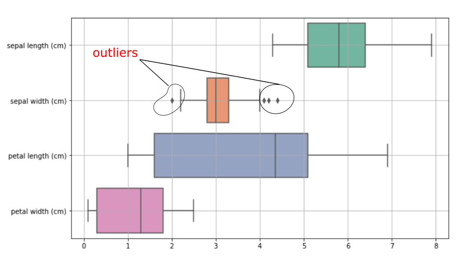
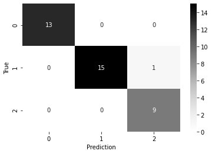

# Iris flower species classification

## Contents
  * [Introduction](#introduction)
  * [Dataset Installation](#dataset)
  * [Project Directory](#directory)
  * [Summary](#summary)
  * [Resources](#resources)

## Introduction: <a name="introduction"></a>
The dataset consists of 50 samples from each of three species of Iris (Iris Setosa, Iris virginica, and Iris versicolor). Four features were measured from each sample: the length and the width of the sepals and petals, in centimeters. This dataset became a typical test case for many statistical classification techniques in machine learning.

## Dataset Installation <a name="dataset"></a>
There are multiple ways to download the dataset, either you can download it from the [kaggle website](https://www.kaggle.com/arshid/iris-flower-dataset) or [UCI Machine Learning repository](https://archive.ics.uci.edu/ml/datasets/Iris) into your local machine or import dataset provided by sklearn. 

## Project Directory <a name="directory"></a>
The project is developed in jupyter notebook and the directory contains the following notebook files:
```
1. EDA_and_statistical_testing.ipynb
```
This file contains exploratory data analysis and statistical testing on the iris dataset. The key insights between the feature columns is observed with the help or `pairplot`, `scatterplot` and `histplot` using `seaborn` library.
<br>
<br>
With the help of univariate and bivariate testing, key insights from individual and between two feature columns is observed. `BOX PLOT` is applied on the feature columns to measure the variability of the data and outliers. 
<p align="center">
  
</p>


Other testing includes measurement of skewness, kurtosis. This gave us some insights about the data such as we found out that features "petal length" and "petal width" are not normally distributed and they have strong skewness and significant excess kurtosis.

```
2. Machine_Learning_Classifiers.ipynb
```
This file contains application and evaluation of different machine learning classification models on the iris flower dataset. The following listed machine learning models are trained and applied:

* Naive Bayes classifier 
* Logistic regression 
* K-nearest Neighbors and hyperparameter tuning using GridSearchCV
* Support Vector Machines 
* Decision Trees, and 
* Random Forest 

### Metrics used? 
Training and testing accuracy is calculated along with a `classification_report` and `confusion_matrix` from the `sklearn`. The following figure depicts a general idea of confusion matrix came out from the results of test data after logistic regression. For more understanding, please follow the notebook. 
<p align="center">
  
</p>

The model is misclassifying only one data point in virginica(label "2") although the true class is versicolor(label: "1"). The accuracy came out was 97.37%.

## Summary <a name="summary"></a>
The following summary is indicating which machine learning model outperformed well on the iris dataset. Please follow the detail description from the notebook file. 

| Model | Train accuracy | Test accuracy | Remarks |
| --- | --- | --- | --- |
| Naive Bayes classifier | 94.64% | 100% | misclassifying 5 datapoints incorrectly while training, leads to overfitting with a test accuracy greater than train accuracy. |
| Logistic regression | 97.32%  | 97.37% | only making one misclassification error |
| K-nearest Neighbors |  97.32%  | 94.74% | KNN misclassifies 2 datapoints in virginica class although they belong to versicolor class. We are unable to improve the test accuracy of the KNN model even after choosing best hyperparameter selection|
| Support Vector Machines |  97.32%  | 89.74% | Linear SVM model is applied while versicolor and virginica data points are overlapping on each other. We can use any other kernel, such as RBF kernet but it is giving lower accuracy than the linear kernel. Linear SVM misclassified 4 datapoints wrongly. |
| Decision Trees | - | - | misclassifying 3 data points after several hyperparameter tuning. |
| Random Forest | 97.32% | 94.74% | Random Forest Classifier is only making 2 misclassification errors and incorrectly classifies 2 datapoints in virginica class although originally it belongs to the versicolor class. | 

# Resources:  <a name="resources"></a>
1. [Kaggel Resources](https://www.kaggle.com/kumarsatwik/beginner-iris-dataset-classification/notebook)
